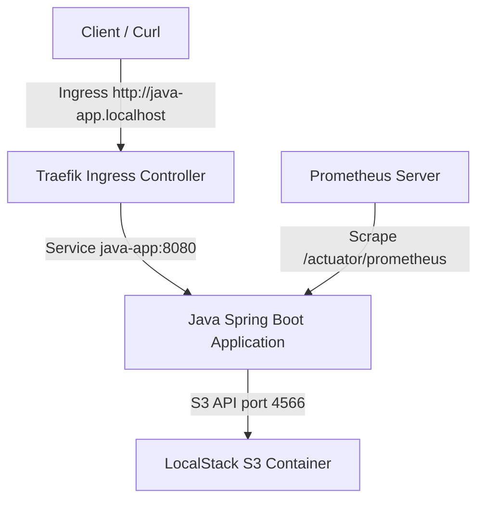

# Auto-Deployment of Java Spring Boot App on K3s with LocalStack S3

This project provides a complete end-to-end local development environment showing how to build, containerize, and deploy a Java Spring Boot application that integrates with LocalStack (simulating AWS S3 services) on a local K3s/k3d Kubernetes cluster.

---

## 1. Project Structure
The repository is organized as follows:
- **java-app/**: Java Spring Boot 3.x source code and Maven configurations.
  - `pom.xml`: Defines core dependencies: Web, Actuator, Micrometer Prometheus, and AWS S3 SDK.
  - `src/main/resources/application.yml`: Configuration for LocalStack endpoints, Kubernetes probes, and Actuator metrics.
  - `src/main/java/com/example/demo/`:
    - `DemoApplication.java`: Main bootstrap entrypoint.
    - `S3Config.java`: Configures the `S3Client` bean with LocalStack endpoint override.
    - `FileController.java`: Exposes REST endpoints to upload, download, and list S3 objects.
- **k8s/**: Kubernetes manifests.
  - `namespace.yaml`: Defines `java-app-demo` namespace.
  - `localstack.yaml`: Runs the LocalStack mock service and runs an S3 bucket auto-creation init script.
  - `app.yaml`: Contains Deployment, Service, and Ingress for the Java app.
- **argocd/**: Argo CD resources for GitOps configuration.
  - `application.yaml`: Define the Argo CD Application manifest to track GitHub repository.
  - `README.md`: Explanatory instructions to set up Argo CD.
- **Dockerfile**: Multi-stage Dockerfile compiling Java using Maven and packaging it onto an alpine-based JRE image running as a non-root user.
- **cicd/deploy.sh**: A bash-based CI/CD pipeline simulating local automation (builds jar, builds docker image, loads image to nodes, applies K8s resources, and waits for rollout).

---

## 2. Architecture & Data Flow



1. **Ingress (Traefik)**: Receives external traffic for `java-app.localhost` and routes it to the Spring Boot App service.
2. **Spring Boot App**: Manages REST traffic. When a file is uploaded, the app connects to the `localstack` Kubernetes service on port 4566 and pushes the binary.
3. **LocalStack**: Emulates S3 storage inside K8s. Upon startup, a ConfigMap-mounted shell script executes `awslocal s3 mb s3://my-java-bucket` to prepare the target bucket.
4. **Monitoring**: Prometheus (running in the `monitoring` namespace) discovers the `java-app` pod based on standard scrape annotations and retrieves application health and system performance metrics.

---

## 3. Deployment Guide

### Option A: Local Scripted Deployment
To run the local deployment automation pipeline, execute the deployment script:
```bash
./cicd/deploy.sh
```

The script automatically performs the following steps:
1. Validates CLI prerequisites (`docker`, `kubectl`, `mvn`).
2. Builds the Java application executable package.
3. Builds the production-ready non-root Docker image (`java-app:latest`).
4. Automatically saves and imports the image into the local `k3d-obs-platform` containers so it's accessible without a remote docker registry.
5. Deploys LocalStack and Java application K8s resources into the `java-app-demo` namespace.
6. Waits for rollout completion.

### Option B: GitOps Deployment with Argo CD
If you store the repository on GitHub, you can use Argo CD to orchestrate Continuous Delivery. 
See the detailed guide in [argocd/README.md](file:///home/d/project-name/billing-pipeline/argocd/README.md) and use the manifest [argocd/application.yaml](file:///home/d/project-name/billing-pipeline/argocd/application.yaml) to configure the synchronization.

---

## 4. Verification

### Step A: Verify LocalStack & S3 Bucket
Check that LocalStack has booted and the bucket exists:
```bash
kubectl logs deployment/localstack -n java-app-demo
```
You should see output indicating:
```text
Creating AWS Local S3 buckets...
make_bucket: my-java-bucket
S3 buckets created successfully:
2026-06-18 19:54:00 my-java-bucket
```

### Step B: Interact with the Java REST API
Test the file storage endpoints (S3 proxy):

1. **Upload a file**:
   ```bash
   echo "Hello local AWS on K3s" > test.txt
   curl -H "Host: java-app.localhost" -F "file=@test.txt" http://localhost/api/files
   ```
   *Expected Response:* `File uploaded successfully: test.txt`

2. **List all uploaded files**:
   ```bash
   curl -H "Host: java-app.localhost" http://localhost/api/files
   ```
   *Expected Response:* `["test.txt"]`

3. **Download the file back**:
   ```bash
   curl -H "Host: java-app.localhost" -o downloaded.txt http://localhost/api/files/test.txt
   cat downloaded.txt
   ```
   *Expected Response:* `Hello local AWS on K3s`

### Step C: Verify Actuator and Prometheus Scraping
1. Check Actuator metrics:
   ```bash
   curl -H "Host: java-app.localhost" http://localhost/actuator/prometheus
   ```
   You should see raw Prometheus metrics (e.g. `jvm_memory_used_bytes...`).
   
2. Check Prometheus scraper target discovery:
   Since our pod contains the `prometheus.io/scrape: "true"` annotation, the pre-installed Prometheus server will auto-discover and start scraping it.

---

## 5. Technical Lessons Learned (Gotchas)
- **K3d Image Cache**: In K3s/K3d, you cannot access the host machine's docker image cache directly. The deployment script resolves this by saving the image to a tarball and piping it into `ctr --namespace k8s.io images import -` inside each node.
- **Path-Style Addressing**: LocalStack does not easily support virtual-host style bucket resolving (`bucket-name.localhost:4566`) without complex DNS configurations. S3 Client is configured with `.forcePathStyle(true)` to ensure requests are resolved as `/bucket-name`.
