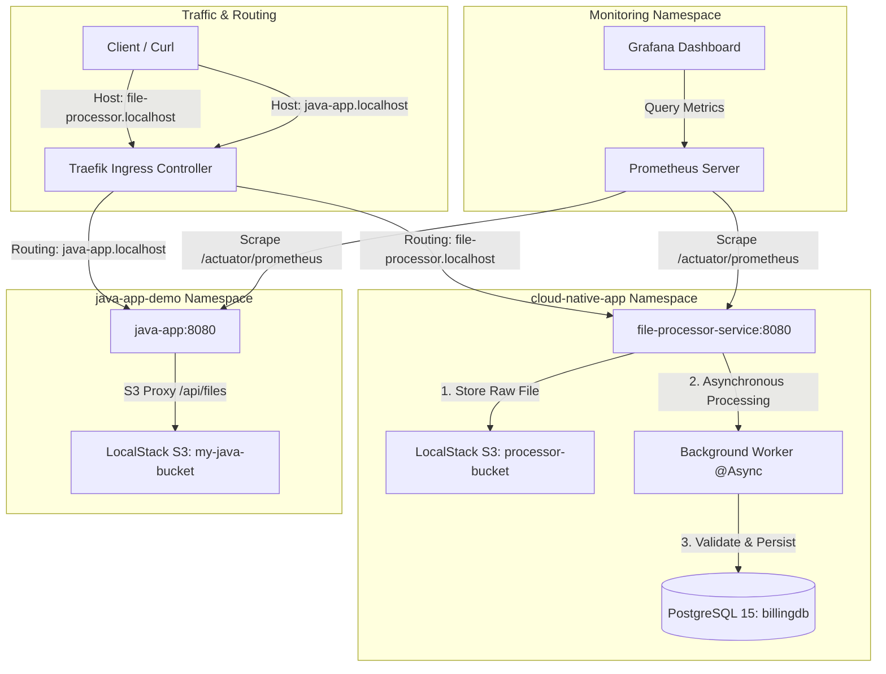

# Cloud-Native Billing Pipeline & File Processor on K3s with LocalStack & PostgreSQL

This repository provides a complete, production-grade cloud-native file processing platform and billing pipeline deployed on a local K3s/k3d Kubernetes cluster. It integrates with **LocalStack (AWS S3 emulation)** for binary file storage, **PostgreSQL 15** with **Flyway** for relational billing persistence, and **Prometheus & Grafana** for observability.

---

## 1. Project Structure
The repository is organized into two primary microservices and supporting infrastructure manifests:

- **file-processor-service/**: Core asynchronous billing file processing service (Java 21 / Spring Boot 3.x).
  - `src/main/java/com/example/fileprocessor/`:
    - `FileProcessorApplication.java`: Spring Boot main entrypoint with `@EnableAsync`.
    - `FileProcessorController.java`: File upload endpoint (`POST /upload`).
    - `FileProcessorService.java`: Coordinates S3 upload, async worker execution, and job status management.
    - `S3Config.java`: S3 client configuration targeting LocalStack endpoint with path-style addressing.
    - `billing/`:
      - `BillingRecord.java` & `BillingRecordEntity.java`: Domain models and JPA entities for parsed billing rows.
      - `BillingParserService.java`: Robust CSV and JSON parser with field-level validation and business rules.
      - `BillingPersistenceService.java`: Repository-backed persistence using Spring Data JPA.
      - `BillingProcessingJob.java`: Entity and repository tracking async job lifecycle (`QUEUED`, `PROCESSING`, `COMPLETED`, `FAILED`).
      - `BillingProcessingJobController.java`: Job querying endpoint (`GET /billing/jobs/{id}`).
      - `BillingSummaryController.java` & `BillingSummaryService.java`: Aggregated billing summary endpoint (`GET /billing/summary`).
  - `src/main/resources/db/migration/`:
    - `V1__create_billing_records.sql`: Initial migration creating the `billing_records` table.
    - `V2__create_billing_processing_jobs.sql`: Migration creating the `billing_processing_jobs` table.
  - `k8s/`: Kubernetes manifests for the `cloud-native-app` namespace (`deployment.yaml`, `postgres.yaml`, `localstack.yaml`, `service.yaml`, `ingress.yaml`, `configmap.yaml`, `secret.yaml`, `servicemonitor.yaml`).
  - `Dockerfile`: Multi-stage Dockerfile running as non-root user (`10001:10001`).

- **java-app/**: S3 object storage demo service (Java 21 / Spring Boot 3.x).
  - `pom.xml`: Maven configuration for Web, Actuator, Micrometer Prometheus, and AWS S3 SDK.
  - `src/main/java/com/example/demo/`: S3 client config and REST controller for uploading/downloading objects (`/api/files`).
  - `k8s/`: Kubernetes manifests for `java-app-demo` namespace (`namespace.yaml`, `localstack.yaml`, `app.yaml`).
  - `cicd/deploy.sh`: Scripted local deployment for `java-app`.

- **k8s/**: Shared manifests for the demo app and LocalStack mock services.
- **argocd/**: Argo CD Application manifests (`application.yaml`) and GitOps documentation (`README.md`).
- **.github/workflows/ci-cd.yml**: Automated CI/CD pipeline running Maven tests, building Docker images, pushing to GitHub Container Registry (`ghcr.io`), and updating Kubernetes manifests.
- **deploy.sh** (root of project): One-command deployment pipeline for the `file-processor-service` stack.

---

## 2. Architecture & Data Flow


```mermaid
graph TD
    subgraph Traffic & Routing
        Client[Client / Curl] -->|Host: file-processor.localhost| Traefik[Traefik Ingress Controller]
        Client -->|Host: java-app.localhost| Traefik
    end

    subgraph cloud-native-app Namespace
        Traefik -->|Routing: file-processor.localhost| FPSvc[file-processor-service:8080]
        FPSvc -->|1. Store Raw File| LS_FP[LocalStack S3: processor-bucket]
        FPSvc -->|2. Asynchronous Processing| Worker[Background Worker @Async]
        Worker -->|3. Validate & Persist| PG[(PostgreSQL 15: billingdb)]
    end

    subgraph java-app-demo Namespace
        Traefik -->|Routing: java-app.localhost| JavaApp[java-app:8080]
        JavaApp -->|S3 Proxy /api/files| LS_Java[LocalStack S3: my-java-bucket]
    end

    subgraph Monitoring Namespace
        Prometheus[Prometheus Server] -->|Scrape /actuator/prometheus| FPSvc
        Prometheus -->|Scrape /actuator/prometheus| JavaApp
        Grafana[Grafana Dashboard] -->|Query Metrics| Prometheus
    end
```

### Data Flow Breakdown:
1. **Ingress (Traefik)**: Routes incoming requests based on the `Host` header:
   - `file-processor.localhost` -> `file-processor-service` in `cloud-native-app`.
   - `java-app.localhost` -> `java-app` in `java-app-demo`.
2. **File Processing Pipeline**:
   - The client uploads a CSV or JSON billing file via `POST /upload`.
   - The raw binary is immediately stored in LocalStack S3 (`processor-bucket`).
   - An asynchronous job is queued and a job token (`jobId`) is returned to the client (`202 Accepted`).
   - The worker parses and validates the file, persisting validated records into PostgreSQL (`billing_records`) and updating job status (`billing_processing_jobs`).
3. **Billing Queries**:
   - Clients poll `GET /billing/jobs/{id}` for job status, processed record count, and total amount.
   - Clients query `GET /billing/summary` for aggregated revenue totals per customer and currency breakdown.
4. **Observability**:
   - Spring Boot Actuator exposes health, readiness, liveness, and Prometheus metrics (`/actuator/prometheus`).
   - Prometheus automatically discovers pods via `prometheus.io/scrape` annotations and `ServiceMonitor` CRDs.

---

## 3. Deployment Guide

### Option A: Local Scripted Deployment (Recommended)

To build and deploy the complete `file-processor-service` with PostgreSQL and LocalStack:
```bash
./deploy.sh
```

To build and deploy the companion `java-app` demo service:
```bash
./cicd/deploy.sh
```

The scripts automatically:
1. Validate prerequisites (`docker`, `kubectl`, `mvn`).
2. Compile and package the Java JARs with Maven.
3. Build container hardened Docker images running as non-root users (`10001:10001`).
4. Import images directly into all `k3d` cluster nodes (`ctr --namespace k8s.io images import -`).
5. Apply Kubernetes manifests (ConfigMaps, Secrets, Deployments, Services, Ingress).
6. Wait for rollout completion of database, storage, and application pods.

### Option B: Automated CI/CD (GitHub Actions)
Pushes to the `main` branch trigger `.github/workflows/ci-cd.yml`:
1. Runs unit and integration test suites for all microservices.
2. Builds Docker images and pushes to GitHub Container Registry (`ghcr.io`).
3. Automatically updates Kubernetes deployment manifests with the new image commit SHA tags.

### Option C: GitOps Deployment with Argo CD
See the detailed guide in [argocd/README.md](argocd/README.md) and apply the manifest:
```bash
kubectl apply -f argocd/application.yaml
```

---

## 4. Verification & Testing

### Step A: Verify Cluster Health
Verify all components are running across the namespaces:
```bash
kubectl get pods -n cloud-native-app
kubectl get pods -n java-app-demo
kubectl get pods -n monitoring
```

### Step B: Test File Processor & Billing API (`cloud-native-app`)

1. **Check Application & Database Health**:
   ```bash
   curl -i -H "Host: file-processor.localhost" http://localhost/actuator/health
   ```
   *Expected Response:* `{"status":"UP","components":{"db":{"status":"UP",...}}}`

2. **Upload a Billing CSV File**:
   ```bash
   cat << 'EOF' > billing.csv
   customerId,invoiceNumber,amount,currency,transactionDate,description
   CUST-100,INV-1001,150.50,USD,2026-09-10,Monthly subscription
   CUST-101,INV-1002,250.00,EUR,2026-09-11,Annual support
   EOF
   curl -i -H "Host: file-processor.localhost" -F "file=@billing.csv" http://localhost/upload
   ```
   *Expected Response:* `{"status":"QUEUED","message":"File accepted for processing","jobId":1,...}`

3. **Check Processing Job Status**:
   ```bash
   curl -H "Host: file-processor.localhost" http://localhost/billing/jobs/1
   ```
   *Expected Response:* `{"jobId":1,"status":"COMPLETED","processedRecords":2,"totalAmount":"400.5000",...}`

4. **Query Aggregated Billing Summary**:
   ```bash
   curl -H "Host: file-processor.localhost" http://localhost/billing/summary
   ```
   *Expected Response:*
   ```json
   {
     "processedRecords": 2,
     "totalAmount": 400.5000,
     "customerTotals": { "CUST-100": 150.5000, "CUST-101": 250.0000 },
     "currencyTotals": { "EUR": 250.0000, "USD": 150.5000 }
   }
   ```

5. **Verify S3 and PostgreSQL Persistence**:
   - Check S3 bucket in LocalStack:
     ```bash
     kubectl exec -n cloud-native-app deployment/localstack -- awslocal s3 ls s3://processor-bucket
     ```
   - Check PostgreSQL tables directly:
     ```bash
     kubectl exec -n cloud-native-app deployment/postgres -- psql -U billingapp -d billingdb -c "SELECT * FROM billing_records;"
     kubectl exec -n cloud-native-app deployment/postgres -- psql -U billingapp -d billingdb -c "SELECT * FROM billing_processing_jobs;"
     ```

### Step C: Test Java S3 Demo App (`java-app-demo`)
1. **Upload a file**:
   ```bash
   echo "Hello local AWS on K3s" > test.txt
   curl -H "Host: java-app.localhost" -F "file=@test.txt" http://localhost/api/files
   ```
2. **List all uploaded files**:
   ```bash
   curl -H "Host: java-app.localhost" http://localhost/api/files
   ```
3. **Download the file back**:
   ```bash
   curl -H "Host: java-app.localhost" -o downloaded.txt http://localhost/api/files/test.txt
   ```

### Step D: Verify Metrics & Prometheus Scraping
1. Check Prometheus metrics exposition:
   ```bash
   curl -H "Host: file-processor.localhost" http://localhost/actuator/prometheus
   curl -H "Host: java-app.localhost" http://localhost/actuator/prometheus
   ```
2. Metrics are scraped by Prometheus and visualized in the pre-configured Grafana dashboards in the `monitoring` namespace.

---

## 5. Technical Lessons Learned (Gotchas)

- **Numeric UID for `runAsNonRoot`**: Kubernetes kubelet requires explicit numeric UIDs (`runAsUser: 10001`, `runAsGroup: 10001`) when enforcing `runAsNonRoot: true`. Non-numeric usernames (such as `USER spring`) cause `CreateContainerConfigError` because the kubelet cannot verify non-root status without looking up `/etc/passwd` inside the image layer.
- **K3d Image Cache**: In K3s/K3d, the cluster nodes do not share the host's Docker daemon cache. The deployment script resolves this by piping `docker save` into `ctr --namespace k8s.io images import -` inside each node container.
- **Path-Style S3 Addressing**: LocalStack cannot resolve virtual-host style buckets (`bucket.localhost:4566`) without custom DNS setup. The AWS S3 SDK client must be explicitly configured with `.forcePathStyle(true)`.
- **Flyway & Hibernate Schema Validation**: With `spring.jpa.hibernate.ddl-auto=validate` enabled in production, every JPA entity must have a corresponding Flyway migration script (`V1__...`, `V2__...`). Omitting migrations causes startup failures during Spring Boot context initialization.
